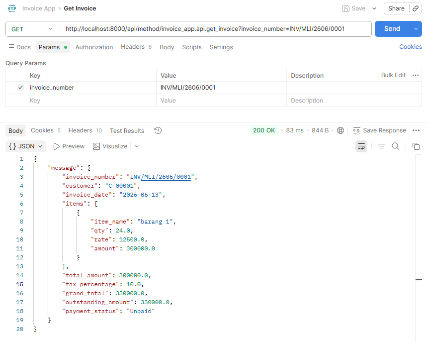
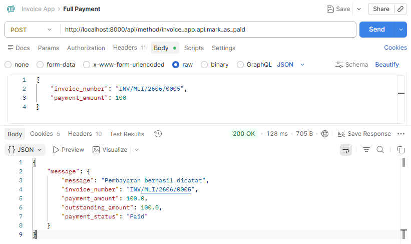
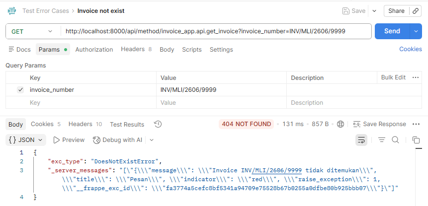
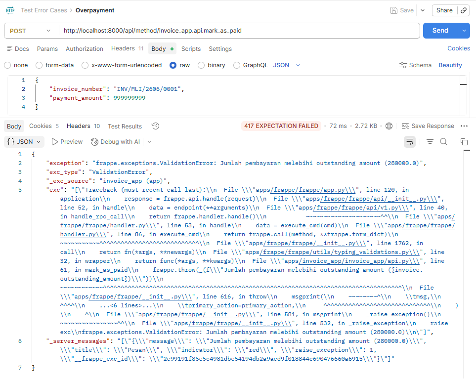
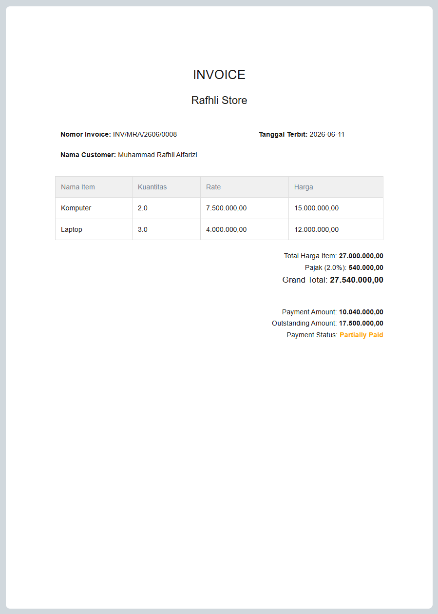

# Invoice App
Custom invoice management app berbasis Framework Frappe.
---

## Cara Setup

### Prasyarat
- Python 3.11+
- Node.js 18+
- MariaDB
- Redis
- Frappe Bench

### Langkah Instalasi

**1. Clone repository ini ke dalam folder apps:**
```bash
cd ~/frappe-bench
bench get-app https://github.com/muhammadrafhlialfarizi/invoice-app-frappe.git
```

**2. Install app ke site:**
```bash
bench --site test-mli.localhost install-app invoice_app
```

**3. Jalankan development server:**
```bash
bench start
```

**4. Akses di browser:**
```
http://localhost:8000
```
Login dengan username `Administrator` dan password yang sudah diset saat `bench new-site`.
---

## Cara Test API (Postman)

### Persiapan
1. Pastikan `bench start` sudah berjalan
2. Buka Postman
3. Lakukan request **Login terlebih dahulu** sebelum request lainnya, karena Frappe menggunakan sistem session
---

### 1. Login
```
POST http://localhost:8000/api/method/login
```
Body (JSON):
```json
{
    "usr": "Administrator",
    "pwd": "admin"
}
```
Response yang diharapkan:
```json
{
    "message": "Logged In"
    "home_page": "/app",
    "full_name": "Administrator"
}
```

---

### 2. GET Invoice
```
GET http://localhost:8000/api/method/invoice_app.api.get_invoice?invoice_number=INV/MLI/2601/00001
```
Ganti `invoice_number` sesuai invoice yang ada di sistem kamu.

Response yang diharapkan:
```json
{
  "message": {  
      "invoice_number": "INV/MLI/2606/0001",
      "customer": "C-00001",
      "invoice_date": "2026-06-13",
      "items": [
          {
              "item_name": "barang 1",
              "qty": 24.0,
              "rate": 12500.0,
              "amount": 300000.0
          }
      ],
      "total_amount": 300000.0,
      "tax_percentage": 10.0,
      "grand_total": 330000.0,
      "outstanding_amount": 330000.0,
      "payment_status": "Unpaid"
  }
}
```

---

### 3. POST Pembayaran
```
POST http://localhost:8000/api/method/invoice_app.api.mark_as_paid
```
Headers:
- `X-Frappe-CSRF-Token: fetch`

Body (JSON):
```json
{
    "invoice_number": "INV/MLI/2601/0001",
    "payment_amount": 50000
}
```
Response yang diharapkan: 
1. `payment_status` berubah menjadi `"Partially Paid"`
2. terdapat respon berikut:
```json
{
  "message": {
      "message": "Pembayaran berhasil dicatat",
      "invoice_number": "INV/MLI/2606/0001",
      "payment_amount": 50000.0,
      "outstanding_amount": 280000.0,
      "payment_status": "Partially Paid"
  }
}
```

---

### 4. POST Pembayaran Lunas (Paid)
Kirim request yang sama dengan sisa outstanding amount.

Body (JSON):
```json
{
    "invoice_number": "INV/MLI/2601/0001",
    "payment_amount": 100
}
```
Response yang diharapkan: `payment_status` berubah menjadi `"Paid"`

---

### 5. Error: Invoice Tidak Ditemukan
Mengirim nomor invoice yang tidak ada di sistem.

Body (JSON):
```json
{
    "invoice_number": "INV/XXX/0000/9999",
    "payment_amount": 50000
}
```
Response yang diharapkan: pesan error bahwa invoice tidak ditemukan.

---

### 6. Error: Pembayaran Melebihi Outstanding
Mengirim jumlah pembayaran yang melebihi sisa tagihan.

Body (JSON):
```json
{
    "invoice_number": "INV/MLI/2601/0001",
    "payment_amount": 999999999
}
```
Response yang diharapkan: pesan error bahwa pembayaran melebihi outstanding amount.

---

## Print Format

Invoice App menyediakan format cetak custom untuk dokumen invoice.

### Cara Mencetak Invoice
1. Buka invoice yang ingin dicetak
2. Klik tombol **Print** di pojok kanan atas
3. Pilih format **"Invoice Print"** di dropdown Format
4. Klik **Print** atau **Download PDF**

### Tampilan Format Cetak
Format cetak menampilkan informasi lengkap invoice meliputi:
- Nama Perusahan
- Nomor invoice dan tanggal terbit
- Nama customer
- Tabel item (nama item, kuantitas, rate, dan total harga per item)
- Ringkasan total harga item, persentase pajak, dan grand total
- Ringkasan payment amount, outstanding amount, dan payment status


[Lihat contoh PDF invoice](invoice_app/docs/format_cetak/INV_MRA_2606_0008.pdf)
---

## Design Decision

### 1. Business Logic di Server-Side (Python)
Semua kalkulasi (total item, pajak, grand total, outstanding amount, payment status) dikerjakan di Python melalui method `before_save()` pada class `Invoice`. Tidak ada logika bisnis yang ditempatkan di JavaScript/client-side. Ini memastikan data tetap konsisten dan tidak bisa dimanipulasi dari browser.

### 2. Custom Naming Invoice
Penamaan invoice menggunakan method `autoname()` yang mengambil inisial nama customer secara dinamis dari database, kemudian dikombinasikan dengan format `YYMM` dan nomor urut. Contoh: customer "Muat Logistik Indonesia" → `INV/MLI/2606/00001`.

### 3. API dengan `frappe.whitelist()`
Semua endpoint API didekorasi dengan `@frappe.whitelist()` agar hanya bisa diakses oleh user yang sudah terautentikasi. Ini mencegah akses publik tanpa login.

### 4. Modularitas Kode
Logika bisnis dipisahkan ke dalam beberapa file:
- `invoice.py` → kalkulasi dan lifecycle hooks Doctype
- `api.py` → endpoint API yang bersih dan hanya bertugas menerima request & mengembalikan response
- `hooks.py` → pendaftaran event Frappe

### 5. Validasi di Layer API
Setiap endpoint API memvalidasi input sebelum memproses data: cek invoice ada atau tidak, jumlah pembayaran valid, dan invoice belum lunas. Error dikembalikan dengan pesan yang jelas menggunakan `frappe.throw()`.
---

## Struktur Proyek

```
invoice_app/
├── invoice_app/
│   ├── api.py                  # Endpoint API (get_invoice, mark_as_paid)
│   ├── hooks.py                # Konfigurasi event Frappe
│   ├── docs/
│   │   └── screenshots/        # Screenshot hasil testing API
│   └── doctype/
│       ├── customer/
│       │   ├── __init__.py
│       │   ├── customer.json   # Definisi Doctype Customer
│       │   └── customer.py     # Model Customer
│       ├── invoice/
│       │   ├── __init__.py
│       │   ├── invoice.json    # Definisi Doctype Invoice
│       │   └── invoice.py      # Business logic Invoice
│       └── invoice_item/
│           ├── __init__.py
│           └── invoice_item.json  # Definisi Child Table Invoice Item
└── README.md
```
---

## Installation (via bench)

```bash
cd ~/frappe-bench
bench get-app https://github.com/muhammadrafhlialfarizi/invoice-app-frappe.git
bench --site test-mli.localhost install-app invoice_app
bench start
```
---

### License

MIT