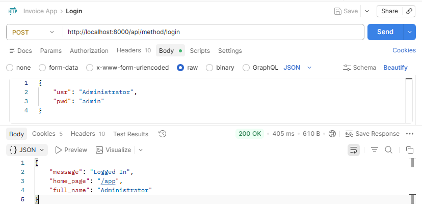
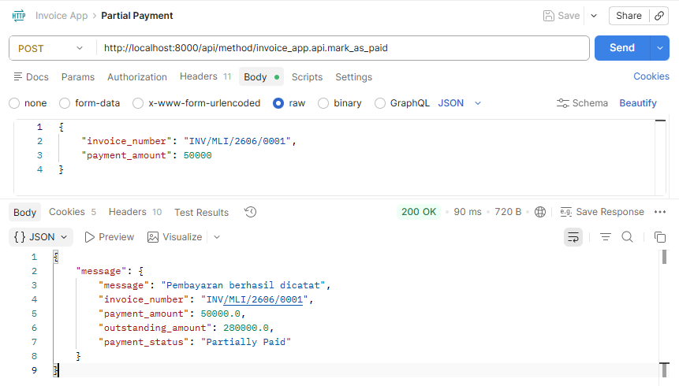

## Cara Test API (Postman)

### Persiapan
1. Pastikan `bench start` sudah berjalan
2. Buka Postman
3. Lakukan request **Login terlebih dahulu** sebelum request lainnya, karena Frappe menggunakan sistem session
---

### 1. Login
```
POST http://localhost:8000/api/method/login
```
Body (JSON):
```json
{
    "usr": "Administrator",
    "pwd": "admin"
}
```
Response yang diharapkan:
```json
{
    "message": "Logged In"
    "home_page": "/app",
    "full_name": "Administrator"
}
```

---

### 2. GET Invoice
```
GET http://localhost:8000/api/method/invoice_app.api.get_invoice?invoice_number=INV/MLI/2601/00001
```
Ganti `invoice_number` sesuai invoice yang ada di sistem kamu.

Response yang diharapkan:
```json
{
  "message": {  
      "invoice_number": "INV/MLI/2606/0001",
      "customer": "C-00001",
      "invoice_date": "2026-06-13",
      "items": [
          {
              "item_name": "barang 1",
              "qty": 24.0,
              "rate": 12500.0,
              "amount": 300000.0
          }
      ],
      "total_amount": 300000.0,
      "tax_percentage": 10.0,
      "grand_total": 330000.0,
      "outstanding_amount": 330000.0,
      "payment_status": "Unpaid"
  }
}
```

---

### 3. POST Pembayaran
```
POST http://localhost:8000/api/method/invoice_app.api.mark_as_paid
```
Headers:
- `X-Frappe-CSRF-Token: fetch`

Body (JSON):
```json
{
    "invoice_number": "INV/MLI/2601/0001",
    "payment_amount": 50000
}
```
Response yang diharapkan: 
1. `payment_status` berubah menjadi `"Partially Paid"`
2. terdapat respon berikut:
```json
{
  "message": {
      "message": "Pembayaran berhasil dicatat",
      "invoice_number": "INV/MLI/2606/0001",
      "payment_amount": 50000.0,
      "outstanding_amount": 280000.0,
      "payment_status": "Partially Paid"
  }
}
```

---

### 4. POST Pembayaran Lunas (Paid)
Kirim request yang sama dengan sisa outstanding amount.

Body (JSON):
```json
{
    "invoice_number": "INV/MLI/2601/0001",
    "payment_amount": 100
}
```
Response yang diharapkan: `payment_status` berubah menjadi `"Paid"`

---

### 5. Error: Invoice Tidak Ditemukan
Mengirim nomor invoice yang tidak ada di sistem.

Body (JSON):
```json
{
    "invoice_number": "INV/XXX/0000/9999",
    "payment_amount": 50000
}
```
Response yang diharapkan: pesan error bahwa invoice tidak ditemukan.

---

### 6. Error: Pembayaran Melebihi Outstanding
Mengirim jumlah pembayaran yang melebihi sisa tagihan.

Body (JSON):
```json
{
    "invoice_number": "INV/MLI/2601/0001",
    "payment_amount": 999999999
}
```
Response yang diharapkan: pesan error bahwa pembayaran melebihi outstanding amount.

---

### Invoice App

Custom invoice management app

### Installation

You can install this app using the [bench](https://github.com/frappe/bench) CLI:

```bash
cd $PATH_TO_YOUR_BENCH
bench get-app $URL_OF_THIS_REPO --branch develop
bench install-app invoice_app
```

### Contributing

This app uses `pre-commit` for code formatting and linting. Please [install pre-commit](https://pre-commit.com/#installation) and enable it for this repository:

```bash
cd apps/invoice_app
pre-commit install
```

Pre-commit is configured to use the following tools for checking and formatting your code:

- ruff
- eslint
- prettier
- pyupgrade

### CI

This app can use GitHub Actions for CI. The following workflows are configured:

- CI: Installs this app and runs unit tests on every push to `develop` branch.
- Linters: Runs [Frappe Semgrep Rules](https://github.com/frappe/semgrep-rules) and [pip-audit](https://pypi.org/project/pip-audit/) on every pull request.


### License

mit
